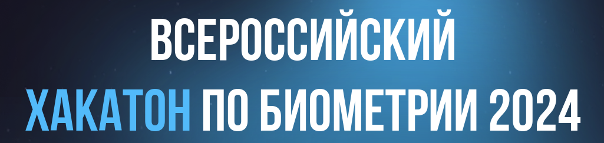

# Декодирование изображения лица из вектора



## Ссылки

Сайт соревнования: [biometricshack.ru](https://biometricshack.ru/) \
GitHub: [github.com/werserk/biometrics-hack](https://github.com/werserk/biometrics-hack) \
Презентация: [not ready]()

## Installation

Clone the repository:

```bash
git clone https://github.com/werserk/biometrics-hack.git
```

Clone Arc2Face repository:

```bash
git clone https://github.com/FoivosPar/Arc2Face.git
```

Install:
https://nvlabs-fi-cdn.nvidia.com/stylegan2-ada-pytorch/pretrained/ffhq.pkl

Install dependencies with poetry (requires python 3.12):

```bash
poetry install
```